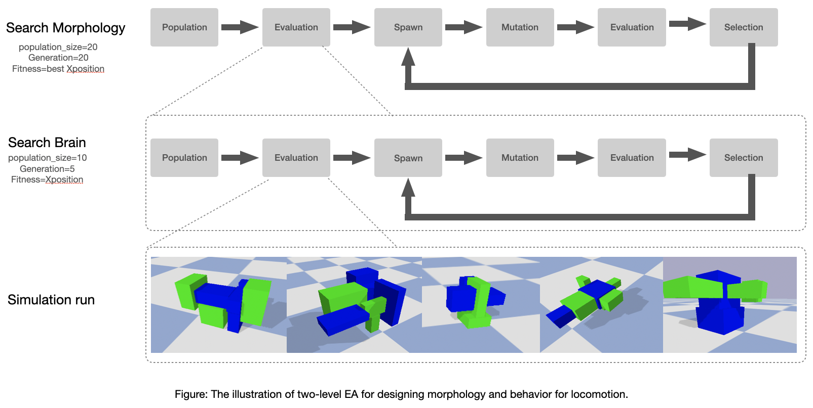
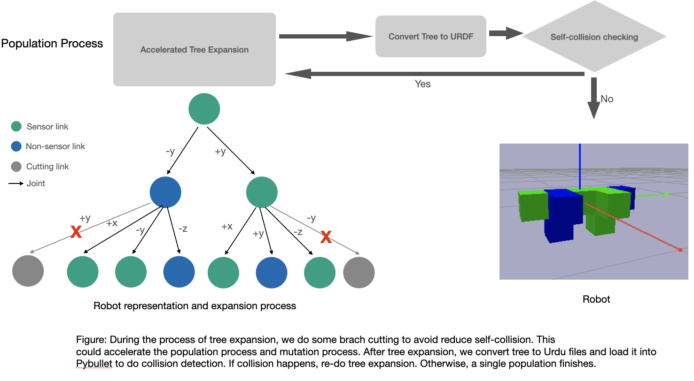
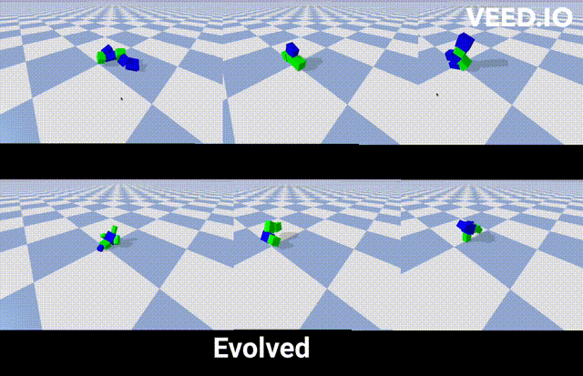
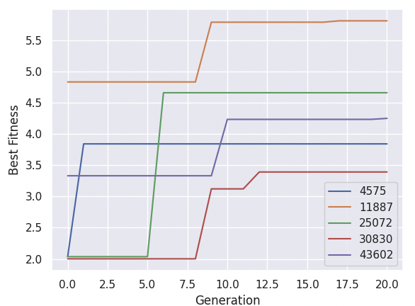

# Northwestern University Course - Artificial Life

## Assignment 8: Design morphology and behavior for locomotion.

[video](https://youtu.be/FtZl_7wjoMU)

## I Overview

  This assignment is about using evolutionary algorithms (EA) to design a robot morphology and behavior for locomotion. The goal is to optimize both the robot's physical shape and its control strategy to achieve efficient and robust locomotion. The approach will use a parallel hill climber of EA that will run in a distributed computing environment to explore the design space efficiently. Here is an overview:

  


## II Method

  In this project, the Evolutionary Algorithm (EA) is used to optimize both the morphology and behavior of a robot for locomotion. The EA works by creating a population of candidate solutions (i.e. robots) and iteratively improving them through selection, reproduction, and mutation. We illustrate the population in the following figure.

  
  

  Each candidate solution (robot) is evaluated using a fitness function that quantifies its performance in terms of locomotion. The fitness function takes into account various criteria such as speed, stability, energy efficiency, and other desired properties of locomotion.

  After evaluating the fitness of each candidate solution, the EA selects the most fit solutions and uses them to create the next generation of robots through reproduction and mutation. The process continues until a satisfactory solution (i.e. robot) is found, or a certain stopping criterion (e.g. maximum number of generations) is met. We illustrate the mutation in the following figure.

  

## III Run and Replay Result

  To run the EA, use following command: 
  
  ```
  cd Assignment8
  python search_morphology.py
  ```

  To replay the best and random result, use following command: 
  
  ```
  cd Assignment8
  python replay_brain.py best best seed_id
  python replay_brain.py random best seed_id
  ```

  


## IV Result

  Here is a plot containing five fitness curves, each starting from five different random seed, showing the fitness of the best creature in the population at each generation.

  


## notes on the code 

  `ea_morphology/solutuion.py`:This code defines a Node class to represent a node in a tree structure, where each node has a size attribute and a list of children nodes. The Random_Node function creates a random node with a size attribute within a given range. The Expand_Node function takes a root_node and recursively expands it into a tree with a maximum depth of maximum_depth, randomly deciding whether to expand each child node or not. The Mutate function performs a mutation operation on a given tree. It first creates a deep copy of the input tree_root to avoid modifying the original tree. Then, it uses the traverse_node function to obtain a list of all the nodes in the tree along with their depths. Next, it selects a random node n from the list of nodes and the depth d of that node. The Expand_Node function is then called on this node n to create a modified version of the tree with a new subtree appended to n at depth d+1. Finally, the mutated tree is returned.

  `others`:
  representation: tree, tranverse,
  optimization: cutting branch when advance confict detection happens
  mutation: pick a node, expand 
  sensor num need to grater than 0

### citations

  ```
  Evolving 3D Morphology and Behavior by Competition
  Evolving Virtual Creatures
  ludobots: https://www.reddit.com/r/ludobots/
  pics: https://slate.com/technology/2022/12/octopus-californicus-rescue-babies-eggs-raised.html
  pyrosim: https://github.com/ccappelle/pyrosim
  pybullet: https://docs.google.com/document/d/10sXEhzFRSnvFcl3XxNGhnD4N2SedqwdAvK3dsihxVUA/edit 
  ```

