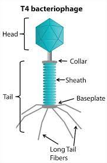
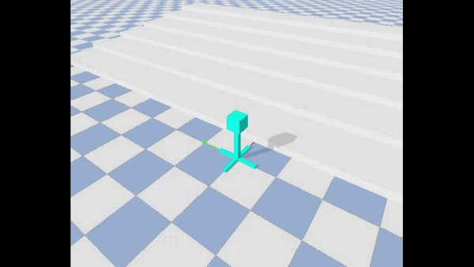
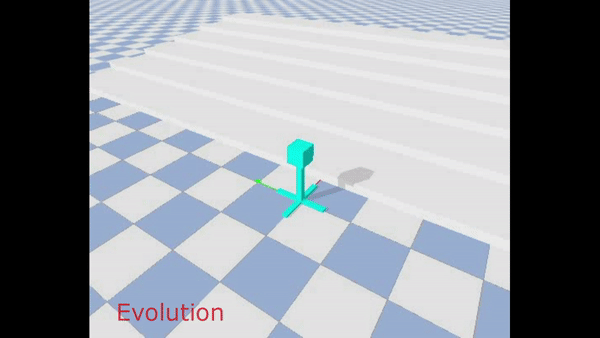

# Northwestern University Course - Artificial Life

## Assignment 5: design your own creatures

[video](https://youtu.be/9l8x-92wuOg)

### Step1. Run

  In this assignment, I design a virus-shape robot, use EA(Evolutation Algorithm) to make robot climb steps. The EA try to maximize the fitness function. The fitness of EA is `Zposition+Xposition`.

  Notice that this program needs at least 60 cpus to run. Because the `numberOfGenerations=5` and `populationSize=60`. To run the EA, use following command: 
  
  ```
  python search.py
  ```

### Step2. Replay
  
  To replay the results in the vidoes, run this:
  
  ```
  python replay.py random
  python replay.py best
  ```

   | | 
  :-------------------------:|:-------------------------:|:-------------------------:

